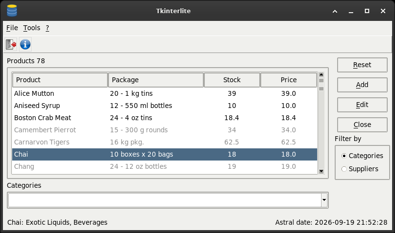

# Tkinterlite (Tkinter & SQLite)

[](https://www.python.org/downloads/)
[](https://docs.python.org/3/library/tk.html)
[](https://www.sqlite.org/index.html)

**How to create a full GUI application with Python, SQLite and Tkinter, batteries included.**

A complete desktop application - lists, forms, a database - written with Python, Tkinter and
SQLite, and nothing else: the standard library only, no dependency to install.



It manages the products, categories and suppliers of a small Northwind-style database. What it
is really for is to be read: how such an application is put together, and why.

## Run it

```
python3 tkinterlite.py
```

Python 3 with Tk 8.6. The database, the log and the configuration live beside the program, so
it can be started from any folder. Window size and theme are in `tkinterlite.ini`.

To watch it work, start it with the trace: the terminal shows, line by line, what the program does
and what its variables hold, while you use the window.

```
python3 tkinterlite.py --trace
```

To see where the time goes, the profiler of the standard library runs it as it is:

```
python3 -m cProfile -s cumulative tkinterlite.py
```

## Tests

```
python3 -m unittest discover -s tests -v
```

`unittest`, from the standard library. The tests use a database in memory and temporary files:
`northwind.sl3` is never touched.

## Start again from the original data

`tkinterlite.sql` holds the whole database, schema and data. To go back to it:

```
rm northwind.sl3
sqlite3 northwind.sl3 < tkinterlite.sql
```

## How it is built

- [ARCHITECTURE.md](ARCHITECTURE.md): the design, and the one it replaced. Composition instead
  of a mixin, the Observer, errors that rise to one net, a thread done right with Tkinter.
- [HOW_IT_WORKS.md](HOW_IT_WORKS.md): the program followed while it runs - the start, a click,
  a save, a window opened twice, an error, a tick of the clock, the exit - method by method.
- [CONVENTIONS.md](CONVENTIONS.md): the rules the code is written by.

A few things are written by hand on purpose - the log, the configuration reader, the Observer,
the register of open windows -
where the standard library has a module that would do it: this is a project for learning, and a
short class shows what those modules do underneath.

## History

Tkinterlite began in spring 2017, and was rewritten in the autumn of 2026. From the first README:

> Developend on Debian Release 9 (stretch) 64-bit.
>
> Spring 2017
>
> Hi all, here we are!
>
> tkinterlite, (Tkinter Sqlite) is my personal study on python 3.4.2 tkinter and sqlite, and by
> the way the beginning of my adventure with git-hub.
>
> enjoy yourself

## Licence

GNU GPL, version 3 or later. See [LICENSE](LICENSE).
